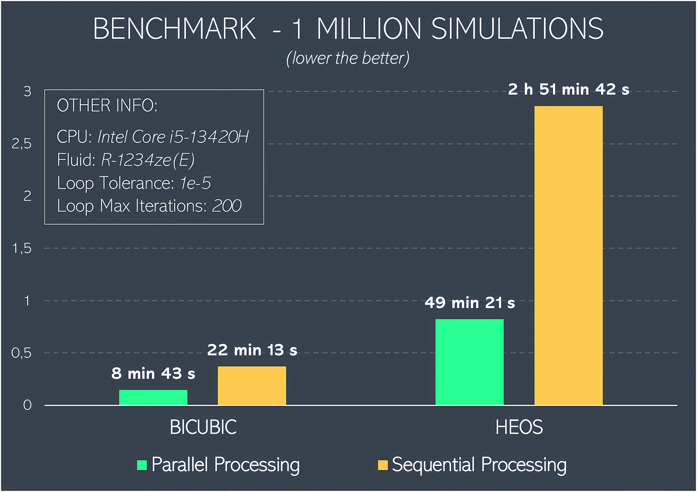

# 

## SIMERC - EJECTOR REFRIGERATION CYCLE SIMULATOR
  
SIMERC is a program developed in Python as part of a Chemical Engineering undergraduate thesis (Final Course Project). It allows simulating ejector refrigeration cycles, as well as running batch simulations to test multiple cases and export the results.  
[CoolProp](https://coolprop.org/) is used to calculate thermodynamic properties, and the ejector follows the model developed by [Cardemil and Colle (2012)](https://doi.org/10.1016/j.enconman.2012.05.009).
  

Program Preview:

    Main tab

  
Among the features of this program are:
- Use of [CoolProp](https://coolprop.org/), which provides accurate results for most refrigerant fluids
- Two [CoolProp](https://coolprop.org/) backends were implemented: HEOS (default) and [BICUBIC&HEOS](https://coolprop.org/coolprop/Tabular.html) (for faster calculations)
- The code responsible for the mathematical part of the simulation was written in [Cython](https://cython.org/), greatly improving the program's performance
- The user can run batch simulations using **Parallel Processing**, useful for cases with many simulations
- Batch simulations use previous solutions as a starting point for new ones, reducing the number of iterations required and speeding up the simulation (***warm start***).
- Batch Sim results can be viewed within the program itself, and exported as csv, xlsx, or parquet
- The parameters $\phi_m$ and $\psi$ can be expressions as functions of _Ar_ and _Pr_, as in the work of [Cardemil and Colle (2012)](https://doi.org/10.1016/j.enconman.2012.05.009).
  
Example of results obtained for R134a, using the BICUBIC backend with 1 million simulations (the graphical visualization was made using [Blender](https://www.blender.org/), based on [this data](https://drive.google.com/drive/folders/1IA9rttPIPdTGxCPez936W97WVgaiG7nm?usp=drive_link) exported by SIMERC):

  
## Other program screenshots:

    Batch Sim tab

  

    Batch Sim Table tab

  

    Settings tab

  
 

## Benchmark
Benchmark performed with 1 million simulations using SIMERC, comparing the HEOS and BICUIC backends and also the impact of parallel and sequential processing. A reduction in simulation time of approximately **20x** was observed between the worst and best case scenarios.

    Benckmark - 1 Million Simulations  

  
 

  
  
# CODE AND DOWNLOAD
  
SIMERC has been made available as a Windows executable via [PyInstaller](https://pyinstaller.org/en/stable/) and can be downloaded [HERE](https://github.com/GPCTM-BR/SIMERC/releases/tag/SIMERC_v1.0).  
Additionally, all the code can also be accessed [here](SIMERC/Code/)
  
## Other Information
External Python packages used in this project, whether in the main program or in secondary scripts:
- [Flet](https://flet.dev/)
- [CoolProp](https://coolprop.org/)
- [NumPy](https://numpy.org/)
- [PyArrow](https://arrow.apache.org/docs/python/index.html)
- [SciPy](https://scipy.org/)
- [XlsxWritter](https://xlsxwriter.readthedocs.io/)
- [Cython](https://cython.org/)
- [Pandas](https://pandas.pydata.org/)
- [PyInstaller](https://pyinstaller.org/en/stable/)
  
  
## License
This project is licensed under the Apache-2.0 License — see the [LICENSE](GPCTM-BR/SIMERC/LICENSE.txt) file for details.
  
  
# 

    SIMERC Icon

