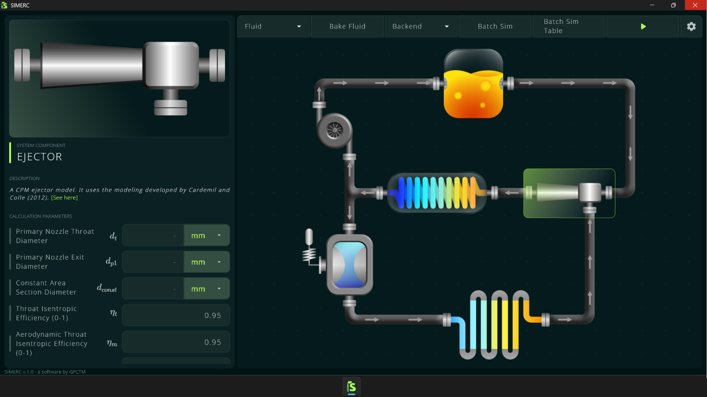
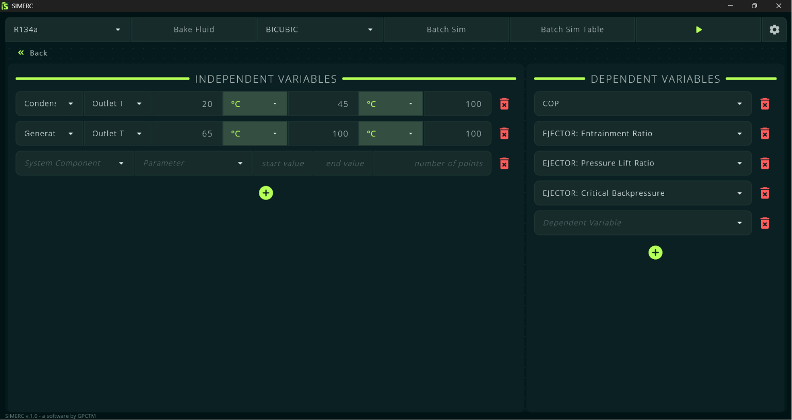
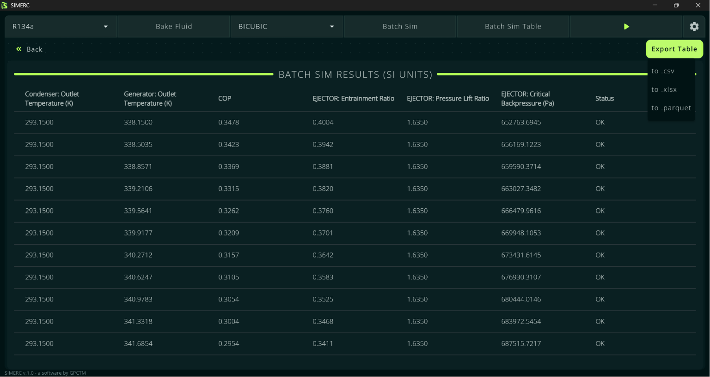
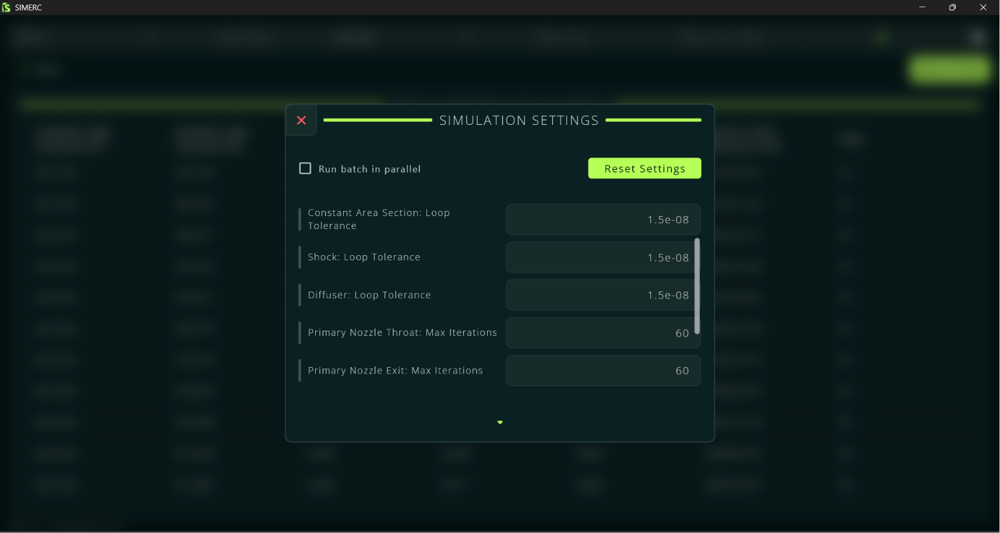

# 

## SIMERC - EJECTOR REFRIGERATION CYCLE SIMULATOR
  
SIMERC is a program developed in Python as part of a Chemical Engineering undergraduate thesis (Final Course Project). It allows simulating ejector refrigeration cycles, as well as running batch simulations to test multiple cases and export the results.  
[CoolProp](https://coolprop.org/) is used to calculate thermodynamic properties, and the ejector follows the model developed by [Cardemil and Colle (2012)](https://doi.org/10.1016/j.enconman.2012.05.009).
  

Program Preview:

    Main tab

  
Among the features of this program are:
- Use of [CoolProp](https://coolprop.org/), which provides accurate results for most refrigerant fluids
- Two [CoolProp](https://coolprop.org/) backends were implemented: HEOS (default) and [BICUBIC&HEOS](https://coolprop.org/coolprop/Tabular.html) (for faster calculations)
- The code responsible for the mathematical part of the simulation was written in [Cython](https://cython.org/), greatly improving the program's performance
- The user can run batch simulations using parallel processing, useful for cases with many simulations
- Batch Sim results can be viewed within the program itself, and exported as csv, xlsx, or parquet
- The parameters $\phi_m$ and $\psi$ can be expressions as functions of _Ar_ and _Pr_, as in the work of [Cardemil and Colle (2012)](https://doi.org/10.1016/j.enconman.2012.05.009).
  
Example of results obtained for R134a, using the BICUBIC backend with 8 million simulations (the graphical visualization was made using [Blender](https://www.blender.org/), from [this data](https://drive.google.com/drive/folders/1IA9rttPIPdTGxCPez936W97WVgaiG7nm?usp=sharing) exported by SIMERC):

  
Other program screenshots:

    Batch Sim tab

  

    Batch Sim Table tab

  

    Settings tab

  
  
# CODE AND DOWNLOAD
  
SIMERC has been made available as a Windows executable via [PyInstaller](https://pyinstaller.org/en/stable/) and can be downloaded [here](SIMERC/SIMERC%20-%20Windows.zip).  
Additionally, all the code can also be accessed [here](SIMERC/Code/)
  
## Other Information
External Python packages used in this project, whether in the main program or in secondary scripts:
- [Flet](https://flet.dev/)
- [CoolProp](https://coolprop.org/)
- [NumPy](https://numpy.org/)
- [PyArrow](https://arrow.apache.org/docs/python/index.html)
- [SciPy](https://scipy.org/)
- [XlsxWritter](https://xlsxwriter.readthedocs.io/)
- [Cython](https://cython.org/)
- [Pandas](https://pandas.pydata.org/)
  
  
## License
This project is licensed under the MIT License — see the [LICENSE](SIMERC/LICENSE.txt) file for details.